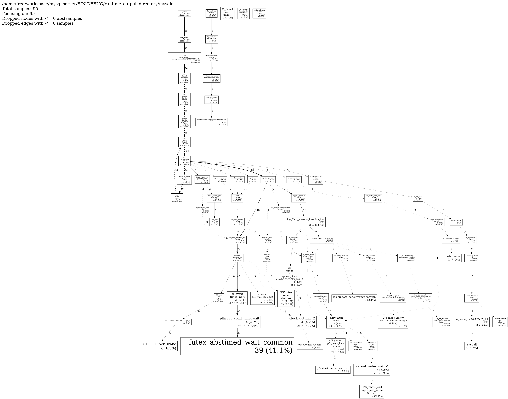
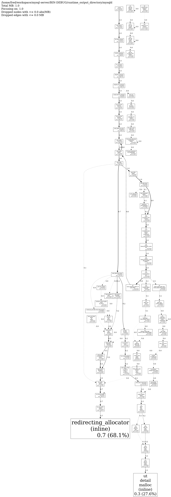
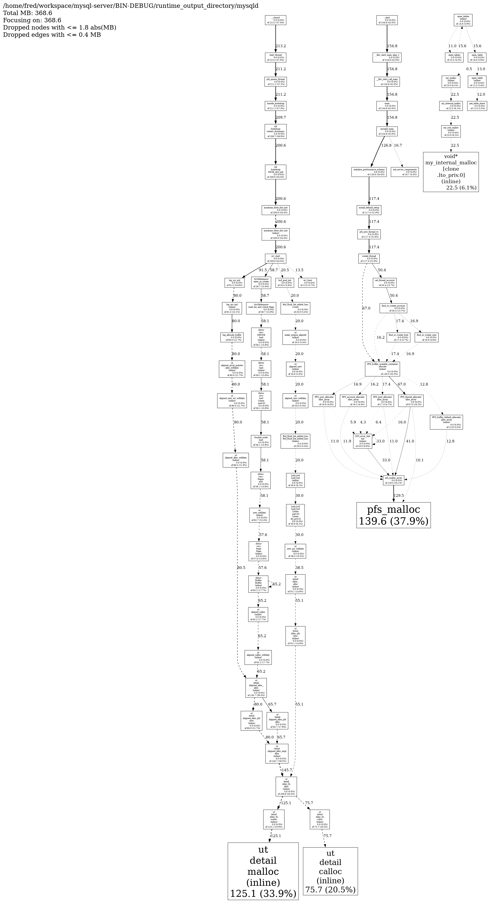

# mysql-component-profiler

This is component collection to extend MySQL providing capabilities using gperftools (https://github.com/gperftools/gperftools).

When using tcmalloc, you have the possibility to profile the memory, the CPU or both. 

When using jemalloc, you have the possibility to profile the memory.

The component uses `pprof` to generate text reports or dot output for tcmalloc and `jeprof` for jemalloc.

## installation & prerequisities

There are 4 components:

- `component_profiler.so`: the main one. It's a dependency of the other ones 
- `component_profiler_cpu.so`: to porfile CPU. It requires `component_profiler.so` to be installed.
- `component_profiler_memory.so`: to profile memory. It requires `component_profiler.so` to be installed.
- `component_profiler_jemalloc_memory.so`: to profile memory. It requires `component_profiler.so` to be installed.

`component_profiler_cpu.so`, `component_profiler_memory.so` and `component_profiler_jemalloc_memory.so` can be installed independently.

To install the components copy the `component_profiler.so` and the memory and/or cpu files into the plugins directory, `/usr/lib64/mysql/plugin/` on Oracle Linux.

### when using tcmalloc

```
MySQL > install component 'file://component_profiler';
Query OK, 0 rows affected (0.0017 sec)

MySQL > install component 'file://component_profiler_cpu';
Query OK, 0 rows affected (0.0017 sec)

MySQL > install component 'file://component_profiler_memory';
Query OK, 0 rows affected (0.0017 sec)

MySQL > select * from mysql.component;
+--------------+--------------------+----------------------------------+
| component_id | component_group_id | component_urn                    |
+--------------+--------------------+----------------------------------+
|            1 |                  1 | file://component_profiler        |
|            2 |                  2 | file://component_profiler_cpu    |
|            3 |                  3 | file://component_profiler_memory |
+--------------+--------------------+----------------------------------+
3 rows in set (0.0006 sec)
```

During the installation of the components, the following lines will be added in the error log:

```
2024-12-12T17:47:19.949654Z 8 [Note] [MY-011071] [Server] Component profiler reported: 'initializing…'
2024-12-12T17:47:19.949691Z 8 [Note] [MY-011071] [Server] Component profiler reported: 'new UDF 'profiler_cleanup()' has been registered successfully.'
2024-12-12T17:47:19.949775Z 8 [Note] [MY-011071] [Server] Component profiler reported: 'new variable 'profiler.dump_path' has been registered successfully.'
2024-12-12T17:47:19.949832Z 8 [Note] [MY-011071] [Server] Component profiler reported: 'new variable 'profiler.pprof_binary' has been registered successfully.'
2024-12-12T17:47:19.952361Z 8 [Note] [MY-011071] [Server] Component profiler reported: 'PFS table has been registered successfully.'
2024-12-12T17:55:29.929491Z 8 [Note] [MY-011071] [Server] Component profiler_memory reported: 'initializing…'
2024-12-12T17:55:29.929533Z 8 [Note] [MY-011071] [Server] Component profiler_memory reported: 'new UDF 'memprof_start()' has been registered successfully.'
2024-12-12T17:55:29.929549Z 8 [Note] [MY-011071] [Server] Component profiler_memory reported: 'new UDF 'memprof_stop()' has been registered successfully.'
2024-12-12T17:55:29.929560Z 8 [Note] [MY-011071] [Server] Component profiler_memory reported: 'new UDF 'memprof_dump()' has been registered successfully.'
2024-12-12T17:55:29.929571Z 8 [Note] [MY-011071] [Server] Component profiler_memory reported: 'new UDF 'memprof_report()' has been registered successfully.'
2024-12-12T17:55:29.929581Z 8 [Note] [MY-011071] [Server] Component profiler_memory reported: 'new UDF 'memprof_diff()' has been registered successfully.'
2024-12-12T17:55:29.929625Z 8 [Note] [MY-011071] [Server] Component profiler_memory reported: 'Status variable(s) registered'
2024-12-12T17:55:34.998066Z 8 [Note] [MY-011071] [Server] Component profiler_cpu reported: 'initializing…'
2024-12-12T17:55:34.998130Z 8 [Note] [MY-011071] [Server] Component profiler_cpu reported: 'new UDF 'cpuprof_start()' has been registered successfully.'
2024-12-12T17:55:34.998151Z 8 [Note] [MY-011071] [Server] Component profiler_cpu reported: 'new UDF 'cpuprof_stop()' has been registered successfully.'
2024-12-12T17:55:34.998164Z 8 [Note] [MY-011071] [Server] Component profiler_cpu reported: 'new UDF 'cpuprof_report()' has been registered successfully.'
2024-12-12T17:55:34.998228Z 8 [Note] [MY-011071] [Server] Component profiler_cpu reported: 'Status variable(s) registered'
```

As we can see several UDFs were created:

```
MySQL > SELECT UDF_NAME FROM performance_schema.user_defined_functions where udf_name like '%PROF_%';
+------------------+
| UDF_NAME         |
+------------------+
| CPUPROF_REPORT   |
| CPUPROF_STOP     |
| MEMPROF_DIFF     |
| MEMPROF_START    |
| PROFILER_CLEANUP |
| MEMPROF_DUMP     |
| MEMPROF_REPORT   |
| MEMPROF_STOP     |
| CPUPROF_START    |
+------------------+
9 rows in set (0.0018 sec)
```

### when using jemalloc

```
MySQL > install component 'file://component_profiler';
Query OK, 0 rows affected (0.0017 sec)

MySQL > install component 'file://component_profiler_jemalloc_memory';
Query OK, 0 rows affected (0.0015 sec)

MySQL > select * from mysql.component;
+--------------+--------------------+-------------------------------------------+
| component_id | component_group_id | component_urn                             |
+--------------+--------------------+-------------------------------------------+
|            1 |                  1 | file://component_profiler                 |
|            2 |                  2 | file://component_profiler_jemalloc_memory |
+--------------+--------------------+-------------------------------------------+
2 rows in set (0.0009 sec)
```

During the installation of the components, the following lines will be added in the error log:

```
2024-10-30T22:52:08.981065Z 8 [Note] [MY-011071] [Server] Component profiler reported: 'initializing…'
2024-10-30T22:52:08.981240Z 8 [Note] [MY-011071] [Server] Component profiler reported: 'new variable 'profiler.dump_path' has been registered successfully.'
2024-10-30T22:52:08.981338Z 8 [Note] [MY-011071] [Server] Component profiler reported: 'new variable 'profiler.pprof_binary' has been registered successfully.'
2024-10-30T22:52:15.324135Z 8 [Note] [MY-011071] [Server] Component profiler_jemalloc_memory reported: 'initializing…'
2024-10-30T22:52:15.324217Z 8 [Note] [MY-011071] [Server] Component profiler_jemalloc_memory reported: 'new UDF 'memprof_jemalloc_start()' has been registered successfully.'
2024-10-30T22:52:15.324245Z 8 [Note] [MY-011071] [Server] Component profiler_jemalloc_memory reported: 'new UDF 'memprof_jemalloc_stop()' has been registered successfully.'
2024-10-30T22:52:15.324265Z 8 [Note] [MY-011071] [Server] Component profiler_jemalloc_memory reported: 'new UDF 'memprof_jemalloc_dump()' has been registered successfully.'
2024-10-30T22:52:15.324284Z 8 [Note] [MY-011071] [Server] Component profiler_jemalloc_memory reported: 'new UDF 'memprof_jemalloc_report()' has been registered successfully.'
2024-10-30T22:52:15.324354Z 8 [Note] [MY-011071] [Server] Component profiler_jemalloc_memory reported: 'Status variable(s) registered'
2024-10-30T22:52:15.324463Z 8 [Note] [MY-011071] [Server] Component profiler_jemalloc_memory reported: 'new variable 'profiler.jeprof_binary' has been registered successfully.
```

As we can see several UDFs were created:

```
SELECT UDF_NAME FROM performance_schema.user_defined_functions where udf_name like '%PROF_%';
+-------------------------+
| UDF_NAME                |
+-------------------------+
| MEMPROF_JEMALLOC_REPORT |
| MEMPROF_JEMALLOC_STOP   |
| MEMPROF_JEMALLOC_START  |
| MEMPROF_JEMALLOC_DUMP   |
+-------------------------+
4 rows in set (0.0007 sec)
```

To use the components, the user needs to have the `SENSITIVE_VARIABLES_OBSERVER` privilege granted.

## global variables

```
MySQL > show global variables like 'profiler.%';
+------------------------+--------------------+
| Variable_name          | Value              |
+------------------------+--------------------+
| profiler.dump_path     | /tmp/mysql.memprof |
| profiler.jeprof_binary | /usr/bin/jeprof    |
| profiler.pprof_binary  | /usr/bin/pprof     |
+------------------------+--------------------+
3 rows in set (0.0045 sec)
```

### profiler.dump_path

This defines where the collected data should be dumped on the server.

### profiler.jeprof_binary

This variable is installed by `component_profiler_jemalloc_memory` and defines where the `jeprof` binary is installed.

### profiler.pprof_binary

The only way to parse the collected data is the use the `pprof` program. This variables defines where is installed the pprof binary executable file.

## status variables

### tcmalloc

```
MySQL > show status like 'profiler.%';
+------------------------+---------+
| Variable_name          | Value   |
+------------------------+---------+
| profiler.cpu_status    | STOPPED |
| profiler.memory_status | STOPPED |
+------------------------+---------+
2 rows in set (0.0107 sec)
```
### jemalloc

```
MySQL > show global status like 'profiler%';
+---------------------------------+---------+
| Variable_name                   | Value   |
+---------------------------------+---------+
| profiler.jemalloc_memory_status | STOPPED |
+---------------------------------+---------+
1 row in set (0.0009 sec)
```

These status variables provides the status of the profiling operations.

## CPU profiling

### start

To start the CPU profiling, we use the following command:

```
MySQL > select cpuprof_start();
+-----------------------+
| cpuprof_start()       |
+-----------------------+
| cpu profiling started |
+-----------------------+
1 row in set (0.0022 sec)
```

Now the status variable changed:

```
MySQL > show status like 'profiler.cpu_status';
+---------------------+---------+
| Variable_name       | Value   |
+---------------------+---------+
| profiler.cpu_status | RUNNING |
+---------------------+---------+
1 row in set (0.0018 sec)
```

### stop

To stop the collection, we use the following statement:

```
MySQL > select cpuprof_stop();
+-----------------------+
| cpuprof_stop()        |
+-----------------------+
| cpu profiling stopped |
+-----------------------+
1 row in set (0.0033 sec)
```

This generates a file `.prof` in the directory and file defined by `profiler.dump_path`:

```
$ ls -lh /tmp/dimk/
total 68K
-rw-rw---- 1 fred fred 68K Oct 14 21:08 mysql.prof
```

### report

Now we can generate a report in two format: TEXT (the default) or DOT.

#### text

To generate the report we use the following statement:

```
MySQL > select cpuprof_report()\G
*************************** 1. row ***************************
cpuprof_report(): Total: 95 samples
      39  41.1%  41.1%       39  41.1% __futex_abstimed_wait_common
       6   6.3%  47.4%        6   6.3% __GI___lll_lock_wake
       4   4.2%  51.6%       45  47.4% ___pthread_cond_timedwait
       4   4.2%  55.8%        5   5.3% __clock_gettime_2
       3   3.2%  58.9%        3   3.2% __getrusage
       3   3.2%  62.1%        6   6.3% pfs_end_mutex_wait_v1
       3   3.2%  65.3%        3   3.2% syscall
       2   2.1%  67.4%        3   3.2% OSMutex::enter (inline)
       2   2.1%  69.5%        2   2.1% PFS_single_stat::aggregate_value (inline)
       2   2.1%  71.6%        2   2.1% log_update_concurrency_margin
       2   2.1%  73.7%       47  49.5% os_event::timed_wait
       2   2.1%  75.8%        2   2.1% pfs_start_mutex_wait_v1
       1   1.1%  76.8%        1   1.1% 0x00007ffb339e8af4
       1   1.1%  77.9%        1   1.1% IB_thread::state (inline)
       1   1.1%  78.9%        1   1.1% Log_files_capacity::next_file_earlier_margin (inline)
       1   1.1%  80.0%       11  11.6% PolicyMutex::enter
       1   1.1%  81.1%        3   3.2% PolicyMutex::pfs_begin_lock (inline)
       1   1.1%  82.1%        1   1.1% ___pthread_mutex_lock
       1   1.1%  83.2%        1   1.1% ___pthread_mutex_unlock
       1   1.1%  84.2%        1   1.1% __condvar_dec_grefs
       1   1.1%  85.3%        1   1.1% __memset_evex_unaligned_erms
       1   1.1%  86.3%        1   1.1% __pthread_cleanup_pop
       1   1.1%  87.4%        1   1.1% __strcpy_evex
... 
```

#### dot

We can generate the content of a dot file that can be used to generate an image:

```
MySQL > select cpuprof_report('dot') into outfile 'cpu.dot';
Query OK, 1 row affected (5.6931 sec)
```

```
$ dot -Tpng cpu.dot -o cpu.png
```



## Memory profiling - tcmalloc

### start

To start the profiling, we need to use the following statement:

```
MySQL > select memprof_start();
+--------------------------+
| memprof_start()          |
+--------------------------+
| memory profiling started |
+--------------------------+
1 row in set (0.0022 sec) 
```

We can confirm this from the status variable:

```
MySQL > show status like 'profiler.memory_status';
+------------------------+---------+
| Variable_name          | Value   |
+------------------------+---------+
| profiler.memory_status | RUNNING |
+------------------------+---------+
1 row in set (0.0071 sec)
```

It's also possible to provide a timeout in seconds to stop the profiling automatically:

```
MySQL > select memprof_start(60);
+-----------------------------------------+
| memprof_start(60)                       |
+-----------------------------------------+
| memory profiling started for 60 seconds |
+-----------------------------------------+
1 row in set (0.0022 sec) 
```


### dump

Differently than for the CPU profiling, we have the possibility to dump the collected data for the memory
to disk manually:

```
MySQL > select memprof_dump();
+------------------------------+
| memprof_dump()               |
+------------------------------+
| memory profiling data dumped |
+------------------------------+
1 row in set (0.0036 sec) 
```

We need to dump at the data we want to use for the reporting. Starting and stopping without dumping, won't produce
any file to parse.

We can also provide information about the dump that will be printed to error log: 

```
MySQL > select memprof_dump('after a large select');
+--------------------------------------+
| memprof_dump('after a large select') |
+--------------------------------------+
| memory profiling data dumped         |
+--------------------------------------+
1 row in set (0.0014 sec)
```

When no string is provided, the default `user request` is used.

We can see in error log:

```
Dumping heap profile to /tmp/dimk/mysql.0001.heap (user request)
Dumping heap profile to /tmp/dimk/mysql.0002.heap (after a large select)
```

And on the filesystem:

```
$ ls -lh /tmp/dimk/*heap
-rw-rw---- 1 fred fred 301K Oct 14 21:32 /tmp/dimk/mysql.0001.heap
-rw-rw---- 1 fred fred 302K Oct 14 21:33 /tmp/dimk/mysql.0002.heap
```

### stop

Before being able to generate a report, we need to stop the memory profiling:

```
MySQL > select memprof_stop();
+--------------------------+
| memprof_stop()           |
+--------------------------+
| memory profiling stopped |
+--------------------------+
1 row in set (0.0035 sec)
```

### report

Now we can generate a report for the memory in two format: TEXT (the default) or DOT.

#### text

To generate the report we use the following statement:

```
MySQL > select memprof_report()\G
*************************** 1. row ***************************
memprof_report(): Total: 1.0 MB
     0.7  68.1%  68.1%      0.7  68.1% redirecting_allocator (inline)
     0.3  27.6%  95.7%      0.3  27.6% ut::detail::malloc (inline)
     0.0   1.5%  97.2%      0.0   1.5% __gnu_cxx::__aligned_membuf::_M_addr (inline)
     0.0   1.4%  98.7%      0.0   1.4% std::__cxx11::basic_string::_M_local_data (inline)
     0.0   1.0%  99.7%      0.0   1.5% std::pair::pair (inline)
     0.0   0.1%  99.8%      0.0   0.4% Table_cache::add_used_table (inline)
     0.0   0.1%  99.8%      0.0   0.1% std::__new_allocator::allocate (inline)
     0.0   0.1%  99.9%      0.0   0.1% std::vector::reserve (inline)
     0.0   0.0%  99.9%      0.0   0.0% std::__detail::_Hashtable_alloc::_M_allocate_buckets [clone .isra.0]
     0.0   0.0% 100.0%      0.0   2.9% std::construct_at (inline)
     0.0   0.0% 100.0%      0.0   0.0% void* my_internal_malloc [clone .lto_priv.0] (inline)
     0.0   0.0% 100.0%      0.0   0.0% ngs::Socket_events::callback_timeout (inline)
     0.0   0.0% 100.0%      0.0   0.0% std::__cxx11::basic_string::_M_capacity (inline)
     0.0   0.0% 100.0%      0.0   2.3% Field_blob::clone
     0.0   0.0% 100.0%      0.0   0.2% Field_blob::store_internal
     0.0   0.0% 100.0%      0.0   1.4% Field_enum::clone
     0.0   0.0% 100.0%      0.0   0.7% Field_long::clone
     0.0   0.0% 100.0%      0.0   3.6% Field_longlong::clone
...
1 row in set (5.0192 sec)
```

#### dot

We can generate the ouput in dot format:

```
MySQL > select memprof_report('dot') into outfile 'memory.dot';
Query OK, 1 row affected (4.7576 sec)
```

We can use the file to generate an image:

```
$ dot -Tpng memory.dot -o memory.png
```



If you don't pass any dump file, all the dump files are used to generate the report. If you want to use a specific file, you can pass the filename as argument:

```
MySQL > select memprof_report('TEXT', 'mysql.memprof.0001.heap')\G
*************************** 1. row ***************************
memprof_report('TEXT', 'mysql.memprof.0001.heap'): Total: 0.0 MB
     0.0  58.4%  58.4%      0.0  58.4% void* my_internal_malloc [clone .lto_priv.0] (inline)
     0.0  35.6%  94.1%      0.0  35.6% ut::detail::malloc (inline)
     0.0   4.2%  98.3%      0.0  36.9% ut::detail::Alloc_pfs::alloc (inline)
     0.0   0.9%  99.2%      0.0   0.9% dd::cache::Element_map::Element_map (inline)
     0.0   0.4%  99.6%      0.0   0.4% addProfiler_element (inline)
     0.0   0.2%  99.8%      0.0   0.2% ngs::Socket_events::callback_timeout (inline)
     0.0   0.1% 100.0%      0.0   0.1% std::pair::pair (inline)
     0.0   0.0% 100.0%      0.0   0.0% udf_impl::memprof_start_udf (inline)
     0.0   0.0% 100.0%      0.0   1.0% Detached_thread::operator (inline)
     0.0   0.0% 100.0%      0.0  11.5% Field_long::clone
     0.0   0.0% 100.0%      0.0   0.4% Item::send
     0.0   0.0% 100.0%      0.0   0.4% Item_func_udf_str::val_str
     0.0   0.0% 100.0%      0.0   3.4% Log_files_dict::add
     0.0   0.0% 100.0%      0.0   3.4% Log_files_dict::add (inline)
     0.0   0.0% 100.0%      0.0  24.5% MEM_ROOT::Alloc (inline)
     0.0   0.0% 100.0%      0.0  41.6% MEM_ROOT::AllocBlock
     0.0   0.0% 100.0%      0.0  41.6% MEM_ROOT::AllocSlow
     ....
```

## Memory profiling - jemalloc

### start

To start the profiling, we need to use the following statement:

```
MySQL > select memprof_jemalloc_start();
+--------------------------+
| memprof_jemalloc_start() |
+--------------------------+
| memory profiling started |
+--------------------------+
1 row in set (0.0002 sec)
```

We can confirm this from the status variable:

```
MySQL > show status like 'profiler.jemalloc_memory_status';
+---------------------------------+---------+
| Variable_name                   | Value   |
+---------------------------------+---------+
| profiler.jemalloc_memory_status | RUNNING |
+---------------------------------+---------+
1 row in set (0.0071 sec)
```

### dump

As for tcmalloc, we have to dump the collected data for the memory
to disk manually:

```
MySQL > select memprof_jemalloc_dump();
+------------------------------+
| memprof_jemalloc_dump()      |
+------------------------------+
| memory profiling data dumped |
+------------------------------+
1 row in set (0.0027 sec)
```

We need to dump at the data we want to use for the reporting. Starting and stopping without dumping, won't produce
any file to parse.

We can see in error log:

```
Using local file /home/fred/workspace/mysql-server/BIN-DEBUG/runtime_output_directory/mysqld.
Using local file /tmp/mysql.memprof.0001.heap.
```

And on the filesystem:

```
$ ls -lh /tmp/*heap
-rw-r----- 1 fred fred 92K Oct 30 23:52 /tmp/mysql.memprof.0001.heap
```

### stop

Before being able to generate a report, we need to stop the memory profiling:

```
MySQL > select memprof_jemalloc_stop();
+--------------------------+
| memprof_jemalloc_stop()  |
+--------------------------+
| memory profiling stopped |
+--------------------------+
1 row in set (0.0005 sec) 
```

### report

Now we can generate a report for the memory in two format: TEXT (the default) or DOT.

#### text

To generate the report we use the following statement:

```
MySQL > select memprof_jemalloc_report()\G
*************************** 1. row ***************************
memprof_jemalloc_report(): Total: 368.6 MB
   139.6  37.9%  37.9%    139.6  37.9% pfs_malloc
   125.1  33.9%  71.8%    125.1  33.9% ut::detail::malloc (inline)
    75.7  20.5%  92.4%     75.7  20.5% ut::detail::calloc (inline)
    22.5   6.1%  98.5%     22.5   6.1% void* my_internal_malloc [clone .lto_priv.0] (inline)
     3.1   0.8%  99.3%      3.1   0.8% operator delete[]
     1.5   0.4%  99.7%      1.5   0.4% my_once_alloc
     0.5   0.1%  99.9%      0.5   0.1% std::__to_chars_bfloat16_t@@GLIBCXX_3.4.31
     0.5   0.1% 100.0%      0.5   0.1% my_openssl_malloc (inline)
     0.0   0.0% 100.0%      0.5   0.1% ::DDSE_dict_recover
     0.0   0.0% 100.0%      1.5   0.4% ::store_plugin_and_referencing_views_metadata
     0.0   0.0% 100.0%      0.5   0.1% AIO::AIO
     0.0   0.0% 100.0%      0.5   0.1% AIO::create
     0.0   0.0% 100.0%      0.5   0.1% AIO::start
     0.0   0.0% 100.0%      0.8   0.2% Acl_cache_lock_guard::lock [clone .part.0]
     0.0   0.0% 100.0%     20.0   5.4% Buf_flush_list_added_lsns::Buf_flush_list_added_lsns (inline)
     0.0   0.0% 100.0%     20.0   5.4% Buf_flush_list_added_lsns::create
     0.0   0.0% 100.0%      0.5   0.1% CRYPTO_malloc@@OPENSSL_3.0.0
     0.0   0.0% 100.0%      0.5   0.1% CRYPTO_zalloc@@OPENSSL_3.0.0
     0.0   0.0% 100.0%      1.5   0.4% Clone_persist_gtid::flush_gtids
     0.0   0.0% 100.0%      1.5   0.4% Clone_persist_gtid::periodic_write
     0.0   0.0% 100.0%      0.5   0.1% Cost_constant_cache::reload
     0.0   0.0% 100.0%      0.5   0.1% Datafile::read_first_page
     0.0   0.0% 100.0%      1.5   0.4% Detached_thread::operator (inline)
     0.0   0.0% 100.0%      7.6   2.0% Double_write::Double_write
     0.0   0.0% 100.0%      7.6   2.0% Double_write::create_v2
     0.0   0.0% 100.0%     58.1  15.8% Double_write::load
     0.0   0.0% 100.0%      0.5   0.1% EVP_CIPHER_fetch@@OPENSSL_3.0.0
     0.0   0.0% 100.0%      1.0   0.3% Events::init 
...
1 row in set (5.0192 sec)
```

#### dot

We can generate the ouput in dot format:

```
MySQL > select memprof_jemalloc_report('dot') into outfile 'jemalloc.dot';
Query OK, 1 row affected (4.7576 sec)
```

We can use the file to generate an image:

```
$ dot -Tpng jemalloc.dot -o jemalloc.png
```


## performance_schema table - profiler_actions

All actions are recorded in a `performance_schema` table called `profiler_actions`:

### tcmalloc

```
MySQL > select * from performance_schema.profiler_actions;
+---------------------+-----------+--------+---------+------------------------------+-------------------+
| LOGGED              | ALLOCATOR | TYPE   | ACTION  | FILENAME                     | EXTRA             |
+---------------------+-----------+--------+---------+------------------------------+-------------------+
| 2024-11-03 15:51:54 | tcmalloc  | memory | started |                              |                   |
| 2024-11-03 15:52:06 | tcmalloc  | memory | dumped  | /tmp/mysql.memprof.0001.heap | user request      |
| 2024-11-03 15:52:13 | tcmalloc  | memory | dumped  | /tmp/mysql.memprof.0002.heap | after large query |
| 2024-11-03 15:52:20 | tcmalloc  | memory | stopped |                              |                   |
| 2024-11-03 15:52:35 | profiler  | cpu    | started | /tmp/mysql.memprof.prof      |                   |
| 2024-11-03 15:52:42 | profiler  | cpu    | stopped | /tmp/mysql.memprof.prof      |                   |
| 2024-11-03 15:53:47 | profiler  | cpu    | report  |                              | text              |
| 2024-11-03 15:53:59 | tcmalloc  | memory | report  |                              | text              |
| 2024-11-03 15:54:38 | tcmalloc  | memory | report  |                              | dot               |
+---------------------+-----------+--------+---------+------------------------------+-------------------+
9 rows in set (0.0008 sec)
```

### jemalloc

```
MySQL > select * from performance_schema.profiler_actions;
+---------------------+-----------+--------+---------+------------------------------+-------+
| LOGGED              | ALLOCATOR | TYPE   | ACTION  | FILENAME                     | EXTRA |
+---------------------+-----------+--------+---------+------------------------------+-------+
| 2024-11-03 16:02:11 | jemalloc  | memory | started |                              |       |
| 2024-11-03 16:02:23 | jemalloc  | memory | dumped  | /tmp/mysql.memprof.0001.heap |       |
| 2024-11-03 16:02:29 | jemalloc  | memory | stopped |                              |       |
| 2024-11-03 16:02:40 | jemalloc  | memory | report  |                              | text  |
| 2024-11-03 16:02:48 | jemalloc  | memory | report  |                              | dot   |
+---------------------+-----------+--------+---------+------------------------------+-------+
5 rows in set (0.0030 sec)
```

## cleanup collected dump files

It's possible to also cleanup the collected dump files. This could be dangerous as
it could be used to try deleting other important files.

The UDF `profiler_cleanup` cleans up all the files in the directory and matching the filenmae specified in the `profiler.dump_path` variable:

```
MySQL > show global variables like 'profiler.dump_path';
+--------------------+--------------------+
| Variable_name      | Value              |
+--------------------+--------------------+
| profiler.dump_path | /tmp/mysql.memprof |
+--------------------+--------------------+
1 row in set (0.0007 sec)

MySQL > select profiler_cleanup();
+------------------------------------------------------------------------+
| profiler_cleanup()                                                     |
+------------------------------------------------------------------------+
| Profiling data matching /tmp/mysql.memprof prefix has been cleaned up. |
+------------------------------------------------------------------------+
1 row in set (0.0008 sec)
```

## errors, warnings, messages

### dependency

When installing `component_profiler_cpu`, `component_profiler_memory` or `component_profiler_jemalloc_memory`, if `component_profiler` is not installed, the following error is displayed: 

```
ERROR: 3534 (HY000): Cannot satisfy dependency for service 'profiler_var'
required by component 'mysql:profiler_cpu_service'.
```

### privilege

The privilege is checked to modify variables and call the UDFs:

```
MySQL > select memprof_report('dot') into outfile 'memory2.dot' ;
ERROR: 1227 (42000): Access denied; you need (at least one of) the 
       SENSITIVE_VARIABLES_OBSERVER privilege(s) for this operation

MySQL > set global profiler.dump_path='/tmp/dimk/mysql2';
ERROR: 1227 (42000): Access denied; you need (at least one of) the
        SENSITIVE_VARIABLES_OBSERVER privilege(s) for this operation
```

### folders and privileges

If the folder doesn't exist or mysql user has no rights, an error will be returned:

```
MySQL > set global profiler.dump_path='/tmp/lefred/mysql';
ERROR: 3200 (HY000): memprof UDF failed; we don't have access to write in that folder.
```

### previous existing data

If there is already data with the same name as defined in `profiler.dump_path`, not profiling can be started:

```
MySQL > select memprof_start();
ERROR: 3200 (HY000): profiler UDF failed; There is already a heap dump, 
       change the 'profiler.dump_path' value first.
```

The previous data must be deleted or another name must be provided.

### report without stopping

Any report must be generated only if the profiling is stopped:

```
MySQL > select memprof_report()\G
ERROR: 3200 (HY000): profiler UDF failed; memory profiler is still running, you need to stop it first.
```

### tcmalloc

MySQL must be started using a gperftools-libs library (`LD_PRELOAD=/usr/lib64/libtcmalloc_and_profiler.so`):

```
MySQL > install component 'file://component_profiler';
ERROR: 1126 (HY000): Can't open shared library '/home/fred/workspace/mysql-server/BIN-DEBUG/lib/plugin/component_profiler.so'
(errno: 0 /home/fred/workspace/mysql-server/BIN-DEBUG/lib/plugin/component_profiler.so: undefined symbol: ProfilerStart)
```

For memory profiling, you need to use one of these libraries:
- `libtcmalloc.so`
- `libtcmalloc_and_profiler.so`

For CPU profiling, you need to use one of those:
- `libprofiler.so`
- `libtcmalloc_and_profiler.so`

### jemalloc

The `jemalloc` library used needs to support profiling. It needs to have been compiled with `--enable-prof`, you can check by using the following command:

```
$ jemalloc-config --config | grep prof
```

If you get `--enable-prof` then it means it's OK. If not, you need to compile `jmalloc` or ask me for an rpm ;)

MySQL needs also to be started using `LD_PRELOAD=/usr/lib64/libjemalloc.so` and the profiling must be enabled using `MALLOC_CONF="prof:true"`,
if not it won't work and you will get the following error:

```
ERROR: 1126 (HY000): Can't open shared library '/home/fred/workspace/mysql-server/BIN-DEBUG/lib/plugin/component_profiler_jemalloc_memory.so'`
(errno: 0 /home/fred/workspace/mysql-server/BIN-DEBUG/lib/plugin/component_profiler_jemalloc_memory.so: undefined symbol: mallctl)
```

### my.cnf or SET PERSIST problem 

It seems that the system variables defined in `my.cnf` or saved using `SET PERSIST` are not used when
restarting MySQL.

This is because the user `bootstrap@localhost` doesn't have the `SENSITIVE_VARIABLES_OBSERVER` privilege:

```
2024-11-04T21:43:50.176044Z 6 [ERROR] [MY-011071] [Server] Component profiler_jemalloc_memory reported: 'user (bootstrap@localhost) has no access to set profiler.jeprof_path variable (privilege SENSITIVE_VARIABLES_OBSERVER required).'
2024-11-04T21:43:50.176070Z 6 [ERROR] [MY-011268] [Server] Configuring persisted options failed: "Access denied; you need (at least one of) the SENSITIVE_VARIABLES_OBSERVER privilege(s) for this operation".
```

However, that user doesn't exist on the system?!? (I need to investigate with the development team).

To fix it, just create the user and assign the privilege:

```
MySQL > CREATE USER bootstrap@localhost IDENTIFIED by RANDOM PASSWORD;
MySQL > CREATE USER bootstrap@127.0.0.1 IDENTIFIED by RANDOM PASSWORD;

MySQL > GRANT SENSITIVE_VARIABLES_OBSERVER ON *.* TO 'bootstrap'@'127.0.0.1';
```